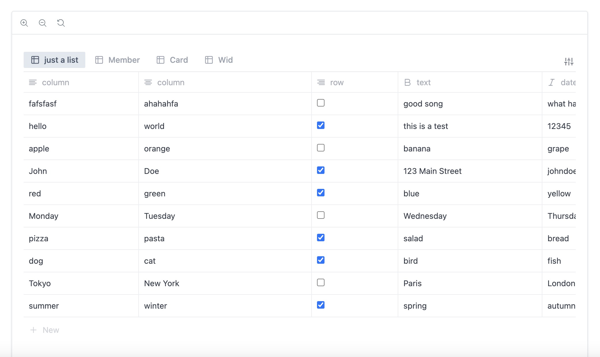

## Botion, datatable inspired by Notion



#### Features:

- Display as Table and List formats.
- List view includes the ability to mark items with an icon.
- Table view allows sorting, filtering, and defining icons.

---

### Usage

1. Add botion to your app

```
yarn add botion
```

2. And added this to my tailwind.config.js file:

```js
module.exports = {
  content: [
   "./pages/**/*.{js,ts,jsx,tsx,mdx}",
   "./components/**/*.{js,ts,jsx,tsx,mdx}",
   "./app/**/*.{js,ts,jsx,tsx,mdx}",
 + "./node_modules/botion/dist/*/**/*.{js,ts,jsx,tsx}",
  ],
```

```jsx
export default function Page() {
  const [active, setActive] = useState(0);
  const [tabData, setTabData] = useState<any>(data);

  const handleClick = (e) => {};

  return (
    <main className='w-full max-w-4xl mx-auto py-10 bg-white min-h-screen'>
      <Botion
        data={tabData}
        active={active}
        onClick={setActive}
        onChange={setTabData}
        onItemClick={handleClick}
      />
    </main>
  );
```
